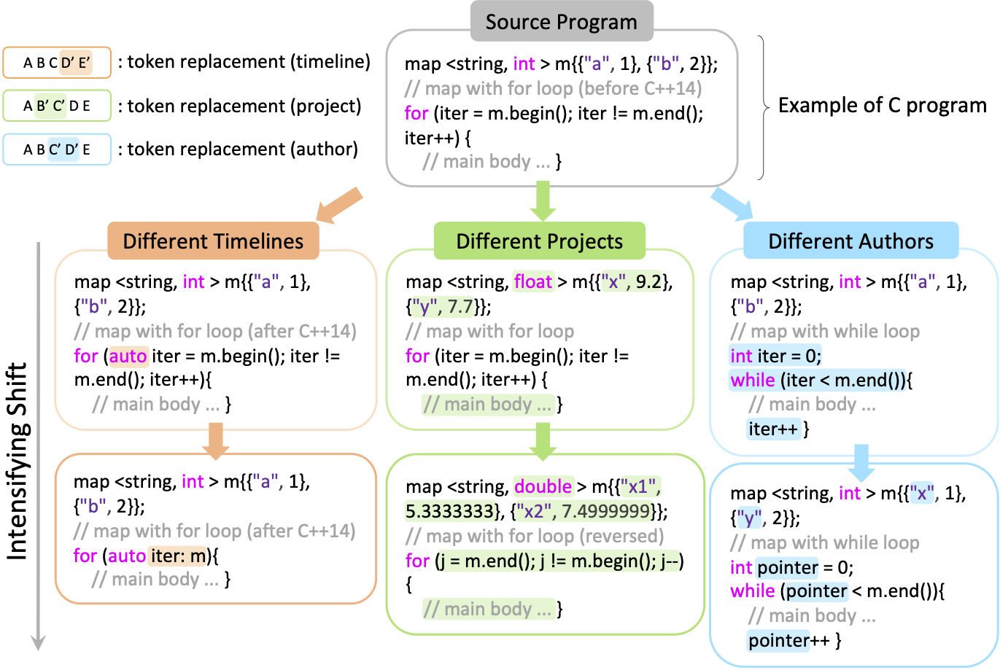
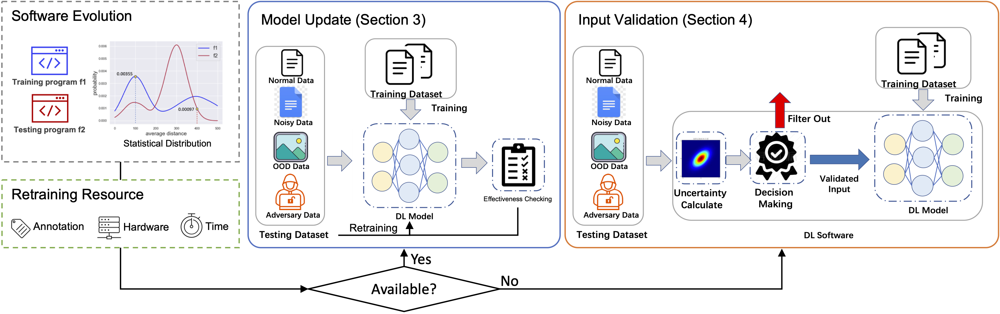

# Uncertainty Study
### [project website](https://99svd.github.io/UncertaintyStudy/)
Understanding and Mitigating Code Data Shifts in Deep Learning-based Code Analysis:

This is a PyTorch implementation of two code analysis tasks, namely, method name prediction (MNP) and code completion (CC) with three model archiectures for each task. We use the Java extractor to preprocess raw code snippets. Users may further extend the work to other programming languages following our study.

<p align="center">
  
</p>

Our study overview:
<p align="center">
  
</p>

Code analysis architecture:
<p align="center">
  
</p>

## Requirements
- [python3.7+](https://www.python.org/downloads/release/python-380/)
- [PyTorch 1.9.0](https://pytorch.org/get-started/locally/)

## Quickstart
### Step 0: Cloning this repository
```
git clone https://github.com/99SVD/UncertaintyStudy.git
cd Uncertainty_Study
```
### Step 1: Download our shifted datasets (from the seven Java projects)
#### Download our preprocessed [dataset](https://drive.google.com/file/d/1kICpY7daVo9pp9MHukTPgi2xUserxdar/view?usp=sharing)
```
unzip dataset
```
### Step 2: Training a model
#### Training a model from scratch
To train a model from scratch:
- Edit the file [scripts/train_cs.sh](scripts/train_cs.sh) and file [scripts/train_cc.sh](scripts/train_cc.sh) to point to the right preprocessed data and a specific model archiecture.
- Before training, you can edit the configuration hyper-parameters in these two files.
- Run the two shell scripts:
```
bash scripts/train_cs.sh # code summary
bash scripts/train_cc.sh # code completion
```
### Step 3: Measuring the five uncertainty scores
- Edit the file [scripts/get_uncertainty.sh](scripts/get_uncertainty.sh) to point to the right preprocessed data, a specific task and a specific model.
- Run the script [scripts/get_uncertainty.sh](scripts/get_uncertainty.sh):
```
bash scripts/get_uncertainty.sh
```
### Step 4: Evaluation the effectiveness of the five uncertainty methods on both error/success prediction and in-/out-of-distribution detection:
- Edit the file [Uncertainty_Eval/evaluation.py](Uncertainty_Eval/evaluation.py) to point to the target evaluation choice (error/success prediction or in-/out-of-distribution detection).
- Run the script [Uncertainty_Eval/evaluation.py](Uncertainty_Eval/evaluation.py):
```
python Uncertainty_Eval/evaluation.py
```
### Step 5: Evaluation the effectiveness of the five uncertainty methods on input validation:
- Edit the file [filter.py](filter.py) to point to the right preprocessed data, a specific task and a specific model.
- Run the script [filter.py](filter.py):
```
python filter.py
```

